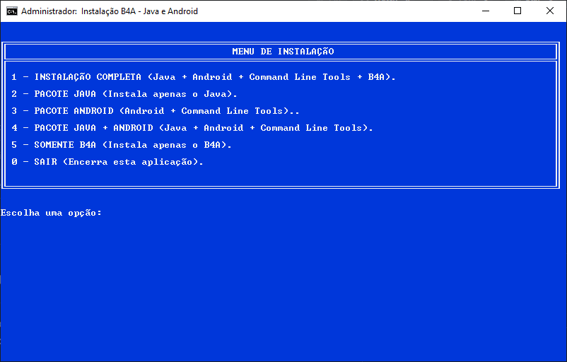

# 🚀 Automação Batch e PowerShell --- Instalação B4A

Projeto de automação para preparação de um ambiente Windows destinado ao
desenvolvimento com **B4A (Basic4Android)**, utilizando scripts **Batch
(.bat)** e **PowerShell** para automatizar a instalação, extração e
configuração das ferramentas necessárias.

O objetivo do projeto é simplificar a preparação do ambiente, reduzindo
a necessidade de executar manualmente diversos instaladores, comandos e
configurações.

------------------------------------------------------------------------
# Imagens


## 📌 Visão geral

Este projeto automatiza etapas como:

-   Verificação de privilégios de Administrador;
-   Preparação dos diretórios necessários;
-   Extração do **JDK**;
-   Extração e preparação do **Android SDK**;
-   Extração das **Android Command Line Tools**;
-   Configuração do ambiente Android;
-   Execução opcional do **B4A**;
-   Exibição de mensagens de progresso no console;
-   Tratamento básico de erros;
-   Organização dos arquivos necessários em uma estrutura de instalação.

A interface do instalador utiliza o **Prompt de Comando do Windows**,
com personalização de cores, tamanho da janela e mensagens de status.

------------------------------------------------------------------------

## 🖥️ Tecnologias utilizadas

  -----------------------------------------------------------------------
  Tecnologia                          Finalidade
  ----------------------------------- -----------------------------------
  **Batch / CMD**                     Controle principal do processo de
                                      instalação

  **PowerShell**                      Extração de arquivos ZIP e execução
                                      de tarefas do Windows

  **Windows CMD**                     Interface de execução do instalador

  **JDK**                             Ambiente Java necessário para o
                                      desenvolvimento Android

  **Android SDK**                     Ferramentas de desenvolvimento
                                      Android

  **Android Command Line Tools**      Ferramentas de linha de comando do
                                      Android

  **B4A**                             Ambiente de desenvolvimento para
                                      aplicações Android
  -----------------------------------------------------------------------

------------------------------------------------------------------------

## 📂 Estrutura sugerida

``` text
B4A-Package/
│
├── download/
│   ├── jdk-19.0.2.zip
│   ├── resources_7_25.zip
│   └── commandlinetools-win-13114758_latest.zip
│
├── install/
│   └── B4A.exe
│
├── scripts/
│   └── instalar.bat
│
├── LICENSE
└── README.md
```

A estrutura pode ser adaptada conforme a organização utilizada na
distribuição do pacote.

------------------------------------------------------------------------

## ⚙️ Funcionamento

O processo de instalação segue, de forma geral, estas etapas:

``` text
┌──────────────────────────────┐
│ Início do instalador         │
└──────────────┬───────────────┘
               │
               ▼
┌──────────────────────────────┐
│ Verifica privilégios Admin   │
└──────────────┬───────────────┘
               │
               ▼
┌──────────────────────────────┐
│ Verifica arquivos necessários│
└──────────────┬───────────────┘
               │
               ▼
┌──────────────────────────────┐
│ Prepara diretório Java       │
└──────────────┬───────────────┘
               │
               ▼
┌──────────────────────────────┐
│ Extrai o JDK                 │
└──────────────┬───────────────┘
               │
               ▼
┌──────────────────────────────┐
│ Prepara Android SDK          │
└──────────────┬───────────────┘
               │
               ▼
┌──────────────────────────────┐
│ Extrai Command Line Tools    │
└──────────────┬───────────────┘
               │
               ▼
┌──────────────────────────────┐
│ Configura o ambiente         │
└──────────────┬───────────────┘
               │
               ▼
┌──────────────────────────────┐
│ Instala/executa B4A          │
│ (quando selecionado)         │
└──────────────┬───────────────┘
               │
               ▼
┌──────────────────────────────┐
│ Instalação concluída         │
└──────────────────────────────┘
```

------------------------------------------------------------------------

## 🔐 Execução como Administrador

O script verifica se está sendo executado com privilégios
administrativos.

Quando necessário, o próprio Batch solicita a elevação utilizando o
PowerShell:

``` bat
net session >nul 2>&1

if %errorlevel% neq 0 (
    powershell.exe -NoProfile -Command ^
        "Start-Process '%~f0' -Verb RunAs"
    exit /b
)
```

Isso permite que o script tenha permissão para criar e modificar
diretórios protegidos e realizar as configurações necessárias.

> **Importante:** os comandos de elevação devem ser revisados antes de
> reutilizar o projeto em outros ambientes.

------------------------------------------------------------------------

## 📦 Extração dos arquivos

A extração dos arquivos ZIP é realizada pelo PowerShell.

Exemplo:

``` bat
powershell.exe -NoProfile -ExecutionPolicy Bypass ^
    -Command "$ProgressPreference='SilentlyContinue'; Expand-Archive -LiteralPath '%PASTA_DOWNLOAD%\jdk-19.0.2.zip' -DestinationPath 'C:\Java' -Force"
```

### Por que utilizar PowerShell?

O PowerShell possui suporte nativo para arquivos ZIP através do:

``` powershell
Expand-Archive
```

Isso permite manter o projeto sem depender obrigatoriamente de
ferramentas externas como 7-Zip ou WinRAR.

------------------------------------------------------------------------

## 🧹 Controle da saída do PowerShell

Durante a extração, o `Expand-Archive` pode apresentar uma barra de
progresso no console.

Para evitar que essa saída interfira na interface personalizada do
instalador, o projeto utiliza:

``` powershell
$ProgressPreference='SilentlyContinue'
```

Exemplo:

``` bat
powershell.exe -NoProfile -ExecutionPolicy Bypass ^
    -Command "$ProgressPreference='SilentlyContinue'; Expand-Archive ..."
```

------------------------------------------------------------------------

## 🎨 Interface do console

O instalador utiliza o próprio CMD como interface gráfica simplificada.

Exemplo:

``` bat
chcp 65001 >nul
mode con: cols=100 lines=35
color 1F
```

### Cores

O comando:

``` bat
color 1F
```

define:

-   `1` → fundo azul;
-   `F` → texto branco.

Outras combinações podem ser utilizadas para destacar mensagens de
sucesso, atenção e erro.

------------------------------------------------------------------------

## 📝 Mensagens de status

A interface pode utilizar mensagens padronizadas como:

``` text
[....] Preparando Java...
[ OK ] Java instalado.

[....] Preparando Android SDK...
[ OK ] Android SDK instalado.

[....] Configurando SDK...
[ OK ] SDK configurado.
```

Essa abordagem facilita a identificação do estágio atual da instalação.

------------------------------------------------------------------------

## 📁 Diretórios utilizados

A configuração do projeto utiliza, como referência:

``` text
C:\Java
C:\Android
```

O diretório `C:\Java` é utilizado para o ambiente Java e `C:\Android`
para os componentes do Android SDK.

> Os caminhos podem ser alterados no script caso seja necessário
> suportar outra estrutura de instalação.

------------------------------------------------------------------------

## 🛠️ Requisitos

Antes de executar o projeto, recomenda-se utilizar:

-   Windows 10 ou superior;
-   PowerShell disponível no sistema;
-   Permissão de Administrador;
-   Espaço em disco suficiente para os arquivos do Android e Java;
-   Arquivos ZIP necessários disponíveis no diretório configurado;
-   B4A, caso a instalação do ambiente B4A também seja desejada.

------------------------------------------------------------------------

## ▶️ Como utilizar

### 1. Baixe ou clone o projeto

``` bash
git clone https://github.com/SEU-USUARIO/SEU-REPOSITORIO.git
```

Entre no diretório:

``` bash
cd SEU-REPOSITORIO
```

### 2. Verifique os arquivos

Confirme se os arquivos necessários estão presentes no diretório
definido pelo script.

### 3. Execute o Batch

Execute:

``` text
instalar.bat
```

Se necessário, o próprio script solicitará privilégios administrativos.

### 4. Acompanhe a instalação

O console apresentará o andamento de cada etapa.

------------------------------------------------------------------------

## ⚠️ Cuidados

Este projeto realiza operações administrativas no Windows.

Antes de executar:

1.  Verifique o conteúdo do script;
2.  Confirme a origem dos arquivos ZIP;
3.  Faça backup de configurações importantes;
4.  Certifique-se de que os caminhos de instalação estão corretos;
5.  Não execute scripts modificados por terceiros sem verificar seu
    conteúdo.

O usuário é responsável por validar os arquivos utilizados na
instalação.

------------------------------------------------------------------------

## 🔒 Segurança

O projeto foi desenvolvido para automatizar tarefas administrativas
locais.

Alguns comandos podem utilizar:

``` text
-ExecutionPolicy Bypass
```

Isso permite que o PowerShell execute o comando utilizado pelo
instalador independentemente da política de execução configurada para
scripts.

**Esse recurso deve ser utilizado com cautela.**

Sempre verifique o conteúdo do script antes da execução e utilize
arquivos obtidos de fontes confiáveis.

------------------------------------------------------------------------

## 🐛 Tratamento de erros

Após operações importantes, recomenda-se verificar o código de retorno:

``` bat
if errorlevel 1 (
    echo [ERRO] Falha na operação.
    pause
    exit /b 1
)
```

Isso evita que uma etapa com falha seja silenciosamente ignorada.

Exemplo:

``` bat
powershell.exe -NoProfile -ExecutionPolicy Bypass ^
    -Command "$ProgressPreference='SilentlyContinue'; Expand-Archive ..."

if errorlevel 1 (
    echo.
    echo [ERRO] Falha ao extrair o JDK.
    pause
    exit /b 1
)

echo [ OK ] JDK instalado.
```

------------------------------------------------------------------------

## 🧩 Personalização

O projeto pode ser adaptado para:

-   Alterar cores do console;
-   Alterar título da janela;
-   Alterar tamanho da janela;
-   Adicionar novas etapas;
-   Adicionar novas ferramentas;
-   Criar menus de seleção;
-   Permitir instalação opcional do B4A;
-   Criar verificações de versões;
-   Validar arquivos antes da instalação;
-   Criar logs;
-   Detectar instalações existentes;
-   Implementar rotinas de atualização;
-   Criar uma rotina de desinstalação.

------------------------------------------------------------------------

## 📋 Possíveis melhorias futuras

-   [ ] Sistema de logs;
-   [ ] Verificação de integridade dos arquivos;
-   [ ] Verificação por hash SHA-256;
-   [ ] Detecção automática de versões já instaladas;
-   [ ] Menu interativo de instalação;
-   [ ] Opção de instalar somente Java;
-   [ ] Opção de instalar somente Android SDK;
-   [ ] Opção de instalar B4A;
-   [ ] Rotina de atualização;
-   [ ] Rotina de desinstalação;
-   [ ] Melhor tratamento de erros;
-   [ ] Interface com progresso personalizada;
-   [ ] Assinatura digital dos executáveis distribuídos.

------------------------------------------------------------------------

## 📜 Licença

Este projeto é distribuído sob uma **licença proprietária**.

Consulte o arquivo:

``` text
LICENSE
```

para conhecer as condições de uso, reprodução, modificação e
distribuição.

A licença não substitui as licenças dos componentes de terceiros
utilizados pelo ambiente B4A, Java ou Android.

------------------------------------------------------------------------

## 👨‍💻 Autor / Projeto

**Ipage Software**

Projeto de automação para preparação de ambiente Windows utilizando
Batch e PowerShell.

------------------------------------------------------------------------

## ⭐ Contribuições

Sugestões, correções e melhorias são bem-vindas.

Para contribuir:

1.  Faça um Fork do projeto;
2.  Crie uma branch para sua alteração;
3.  Faça as modificações;
4.  Teste o script em um ambiente controlado;
5.  Envie um Pull Request descrevendo as alterações.

------------------------------------------------------------------------

## 📌 Aviso

Este projeto automatiza alterações no ambiente Windows e deve ser
utilizado com atenção.

Sempre leia e compreenda os scripts antes de executá-los, principalmente
quando forem executados com privilégios administrativos.
